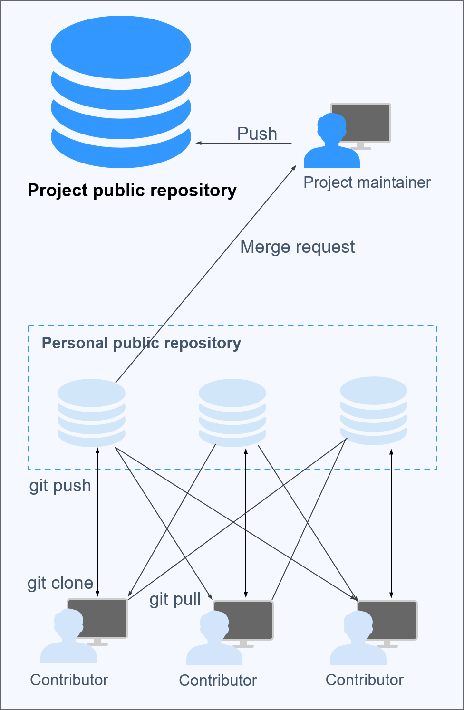

## Introduction

Branching strategies serve as the backbone of software development, influencing team dynamics, deployment frequency, and project success. From the straightforward trunk-based development to the intricate Git flow, each strategy presents unique advantages and challenges. In this comprehensive exploration, we will delve into these strategies and their profound implications.

## Trunk Based Development

Trunk-based development embodies simplicity by maintaining a single branch, commonly known as the trunk or mainline. All developers directly contribute to this branch without the need for additional branches or pull requests. Imagine a team of developers working on a web application. They continuously push changes to the main branch, triggering automated tests and deployments. This method fosters a rapid development cycle but demands meticulous attention to testing, automation, and feature toggles to ensure seamless deployment without disrupting the production environment.

You can find more information about Trunk Based Development here: https://trunkbaseddevelopment.com/

**Practical Tips**

1. **Automate Testing:** Utilize automated testing frameworks to ensure thorough testing of changes before deployment.
2. **Implement Feature Toggles:** Introduce feature toggles to enable/disable new features in production, minimizing disruption.
3. **Maintain Documentation:** Document testing procedures, automation scripts, and feature toggle configurations for reference and onboarding.

## Feature Branching (GitHub Flow)

In contrast, feature branching, epitomized by GitHub Flow, provides a structured approach to development. Each feature or bug fix gets its own branch, allowing developers to work on them independently. Consider a scenario where a team is adding a new search functionality to their e-commerce platform. They create a feature branch specifically for this task, ensuring focused development and testing. Once the feature is ready, it undergoes code review through a pull request before merging into the main branch. This method enhances collaboration and organization, facilitating a more controlled workflow.

**Practical Tips**

1. **Code Review Process:** Establish a robust code review process to maintain code quality and identify potential issues early.
2. **Utilize CI/CD Pipelines:** Integrate continuous integration and deployment pipelines to automate testing and deployment processes.
3. **Regularly Merge Changes:** Encourage frequent merges of feature branches into the main branch to prevent divergence and resolve conflicts promptly.

## Git Flow

Git flow introduces a comprehensive branching model, delineating separate branches for development, features, releases, and hotfixes. This method offers granular control over the development lifecycle but can lead to a convoluted workflow and increased overhead. Picture a large development team working on a complex software project. They adhere to the Git flow branching model, creating feature branches for new functionalities, release branches for version management, and hotfix branches for urgent patches. While this approach offers flexibility, it requires meticulous branch management to maintain consistency and stability.

**Practical Tips**

1. **Strict Branch Naming Convention:** Enforce a strict branch naming convention to distinguish between different types of branches and ensure clarity.
2. **Regular Refactoring:** Schedule regular refactoring sessions to clean up branches, remove obsolete features, and improve branch management efficiency.
3. **Training and Onboarding:** Provide training and onboarding sessions to familiarize team members with Git flow concepts, branch workflows, and best practices.

## Environment Branching (GitLab Flow)
## Git Flow

Environment branching takes branching complexity to new heights by creating branches for each deployment environment, such as staging and integration. While this approach offers granular control over deployment configurations, it can result in a tangled web of branches and merges. Imagine a team managing multiple environments for their web application, including development, staging, and production. They create separate branches for each environment, allowing them to test changes in isolation before deployment. However, coordinating changes across multiple environment branches demands robust testing and deployment automation to ensure consistency and reliability.

**Practical Tips**

1. **Infrastructure as Code (IaC):** Implement Infrastructure as Code (IaC) tools to automate environment provisioning and configuration management, reducing manual overhead and ensuring consistency.
2. **Containerization:** Embrace containerization technologies like Docker to encapsulate applications and dependencies, simplifying environment setup and portability.
3. **GitOps Practices:** Adopt GitOps practices to manage deployment configurations and infrastructure changes through version-controlled repositories, enhancing traceability and repeatability.

## Forking Strategy

The forking strategy thrives in open-source projects, offering a decentralized approach to collaboration. Contributors create forks of the main repository, enabling them to work on changes independently. Picture a group of developers contributing to an open-source library. Each contributor forks the main repository, implements their changes, and submits a pull request for review and integration. This strategy simplifies collaboration and reduces the complexity of permission management, fostering inclusivity within the developer community.

**Practical Tips**

1. **Clear Contribution Guidelines:** Provide clear guidelines for contributors on forking, branch naming, and pull request submission to streamline the contribution process.
2. **Regular Syncing:** Encourage contributors to sync their forks with the main repository regularly to incorporate upstream changes and avoid conflicts.
3. **Engage in Community Discussions:** Foster community engagement and collaboration through open discussions, issue tracking, and feedback channels.

## Comparison Matrix

| Branching Strategy | Advantages | Challenges |
| --- | --- | --- |
| Trunk Based Development | - Simplicity and agility   - Promotes continuous integration and deployment | - Requires meticulous testing and automation   - Risk of disrupting production environment without proper safeguards |
| Feature Branching (GitHub Flow) | - Structured approach to development   - Enables focused development and testing | - Potential for merge conflicts   - Overhead of managing multiple branches |
| Forking Strategy | - Decentralized collaboration   - Simplifies permission management | - Increased complexity in tracking and managing forks   - Potential for divergence from main repository |
| Git Flow | - Granular control over development lifecycle   - Facilitates feature isolation and hotfix management | - Complexity and overhead of managing multiple branch types   - Potential for branch proliferation |
| Environment Branching | - Granular control over deployment configurations   - Facilitates environment-specific testing | - Complexity of managing multiple environment branches   - Increased risk of merge conflicts |

## Conclusion

In conclusion, the choice of branching strategy should align with the specific needs and capabilities of your team. Whether it's the simplicity of trunk-based development, the structured approach of feature branching, or the collaborative nature of forking, each strategy offers its own set of benefits. By carefully evaluating your team's strengths and project requirements, you can select a branching strategy that maximizes efficiency, collaboration
